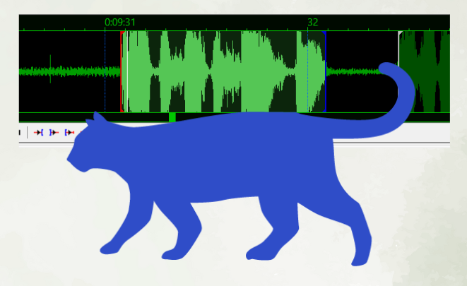

# Post-timing: márgenes, snap y chain

El post-timing parte del intervalo desnudo de voz y le añade lo que la voz no contiene:
el aire de lectura, la alineación con la escena y la continuidad con las líneas vecinas.
Tres operaciones lo consiguen. Los márgenes convierten el intervalo de voz en intervalo
visible. El snap alinea un borde con un corte de escena cercano. La cadena cierra los
huecos que parpadean. Las tres trabajan sobre el mismo intervalo y se ordenan por la
jerarquía de revisión que cierra esta página.

<figure class="tg-fig tg-strip">
Del intervalo de voz al intervalo visible

<i>in</i>
voz · «No lo sé todavía.»
<i>out</i>
vecina

<b class="k-aire">lead-in: aire de entrada, antes de la voz</b>
<b class="k-voz">voz: el intervalo pegado al habla</b>
<b class="k-aire">lead-out: aire de salida, mayor que el de entrada</b>
<b class="k-continuidad">la cadena cierra el hueco que parpadea</b>

Los márgenes convierten el intervalo de voz en intervalo visible; el <b>lead-out</b> base supera al <b>lead-in</b> porque la lectura termina después del habla. La cadena cierra el hueco con la vecina cuando es demasiado corto para leerse como pausa.
</figure>

## Valores de partida

Una primera aplicación estable parte de unos valores conocidos, que la revisión luego
aprieta o afloja según la escena. El aire de entrada arranca en 120 milisegundos y puede
crecer hasta 400; el de salida, en 420 y hasta 800. El snap busca un keyframe hasta 400
milisegundos del inicio y hasta 800 del final, con 100 de margen para entrar antes del
corte. Ninguna línea baja de 500 milisegundos de permanencia, y la lectura por encima de
28 caracteres por segundo queda señalada para revisar. Son puntos de partida, y son
límites de trabajo holgados: el suelo de 500 milisegundos y la señal de 28 caracteres por
segundo cazan solo los casos claros, mientras que la comodidad de lectura se revisa con
los rangos más ceñidos de los [criterios cuantitativos](criterios.md). Cada borde se
confirma comprobando que conserva la lectura, la escena y la continuidad.

## Recorrer de la última línea a la primera

El post-timing a mano decide cada borde desde cero —cuánto aire, qué corte, qué hueco—, y
conviene aplicarlo en orden inverso: de la última línea de la escena hacia la primera. La
razón está en la dependencia entre vecinas. El margen de salida de una línea depende de dónde
empiece la siguiente: hasta fijar el inicio de la línea *n+1* no se sabe cuánto puede
extenderse el final de la *n* sin invadirla, ni cuánto hueco queda para encadenar. Resuelta
antes la línea posterior, cada final anterior se decide mirando un borde ya estable en lugar
de uno que todavía se moverá, y el margen de salida se fija una sola vez.

<figure class="tg-fig tg-strip">
El final de n depende del inicio de n+1

línea n−1
<i>out</i>
<i class="ord" style="left:95%">3</i>

línea n
<i>out</i>
<i class="ord" style="left:95%">2</i>

línea n+1
<i class="ord" style="left:95%">1</i>

El recorrido a mano va de abajo hacia arriba: fijado primero el inicio de la <b>línea n+1</b> (①), el margen de salida de la <b>línea n</b> (②) se extiende hasta tocarlo sin invadirlo, y así hasta la primera línea de la escena.
</figure>

## Los márgenes dan el aire

El margen es lo que transforma el intervalo de voz en intervalo visible. El lead-in
coloca el inicio visible un poco antes de la voz, para que el ojo encuentre el texto a
tiempo; el lead-out conserva la línea un poco después del cierre vocal, para que la
lectura termine. El lead-out base supera al lead-in porque la lectura termina después del
habla, siempre por detrás de la voz. Los máximos marcan cuánto puede crecer ese aire
cuando un snap, un hueco corto o un ritmo visual lo justifican; más allá de ellos, el aire
deja de ayudar y empieza a sentirse como texto muerto.

{ loading=lazy }

## El snap alinea con la escena

El snap mueve un borde visible hacia un keyframe cercano, partiendo del intervalo ya
ampliado por los márgenes. Se rige por reglas claras. El keyframe debe caer dentro de la
ventana de snap del borde. El movimiento debe caber dentro del margen máximo permitido.

<figure class="tg-fig tg-strip">
La ventana de snap de cada borde

<i>in</i>
voz
<i>out</i>
<i class="kf" style="left:76%"></i>
<i class="kf" style="left:95%"></i>

saltaqueda lejos

<b class="k-escena">ventana de snap: 400 ms en el inicio, 800 en el final</b>
<b class="k-aire">el aire base del que parte el borde</b>

Solo el keyframe que cae <b>dentro de la ventana</b> atrae el borde; el corte fuera de alcance deja el final donde los márgenes lo dejaron. La ventana del final dobla a la del inicio porque la escena pesa más en los cierres.
</figure>
La ventana del final es mayor que la del inicio, porque la escena y la continuidad pesan
más en los cierres que en las entradas. El snap puede incluso reducir un lead-out si el
corte cierra mejor que el aire base. Y la cobertura del habla subtitulada conserva la
prioridad: una excepción perceptiva mínima queda para los casos avanzados y se decide línea a línea.

El caso más frecuente es un final cerca de un corte. Cuando la voz termina poco antes de
un keyframe, el final visible puede cerrarse en ese keyframe aunque quede por debajo del
lead-out base, porque un cierre sobre el corte suele ser más estable que dejar texto
muerto en la toma siguiente. Cuando la voz termina justo sobre el keyframe, el final
puede coincidir con el corte si la última sílaba queda cubierta. Y cuando la voz termina
apenas después del keyframe —en un margen del orden de 150 ms—, el final todavía puede
cerrar en el corte si el tramo posterior es perceptivamente mínimo, la lectura ya alcanza
y el resultado controla el desbordamiento hacia la toma siguiente. Esa concesión tiene un
límite: si el tramo que queda tras el corte contiene una palabra completa o información
nueva, el final conserva la voz y renuncia al corte.

<figure class="tg-fig">
Final en keyframe frente a final pasado

<h4>Correcto: final en keyframe</h4>
<video src="../../assets/ejemplos/kf-end.mp4" controls loop playsinline preload="metadata"></video>

El subtítulo termina en el corte de escena; la salida queda limpia y el texto permanece en la toma que lo contiene.

<h4>Incorrecto: final pasado del keyframe</h4>
<video src="../../assets/ejemplos/no-kf-end.mp4" controls loop playsinline preload="metadata"></video>

El final cruza el corte; el texto permanece sobre la toma siguiente y el cambio de escena se siente arrastrado.

La misma escena compara el cierre correcto en el keyframe con el final pasado del corte.
</figure>

## La cadena cierra los huecos

La cadena elimina los huecos visibles entre líneas consecutivas, y existe sobre todo para
corregir parpadeos y huecos de lectura. Se aplica cuando el hueco es demasiado corto para
percibirse como pausa útil, cuando la salida de una línea y la entrada de la siguiente
caben dentro de los márgenes máximos, cuando el resultado conserva una permanencia
razonable y cuando no introduce un solape accidental.

Y se conserva el hueco —no se encadena— cuando la pausa tiene función expresiva, cuando
el hueco es lo bastante largo para leerse como descanso, cuando encadenar alargaría de
más la línea anterior, o cuando la escena cambia de un modo que pide separación. La
decisión, en el fondo, es siempre la misma: se cierra el hueco que distrae y se preserva
el que comunica.

<figure class="tg-fig">
El hueco que parpadea

<h4>Con hueco</h4>
<video src="../../assets/ejemplos/con-gaps.mp4" controls loop playsinline preload="metadata"></video>

Un hueco demasiado corto entre dos líneas se percibe como un parpadeo que distrae.

<h4>Encadenado</h4>
<video src="../../assets/ejemplos/sin-gaps.mp4" controls loop playsinline preload="metadata"></video>

La cadena lleva el hueco a cero y el paso entre líneas deja de distraer.

Se cierra el hueco que distrae; el que comunica una pausa real se conserva.
</figure>

## El orden de la revisión

Cuando las tres operaciones compiten sobre una misma línea, se aplican en este orden:

1. Lectura suficiente.
2. Habla subtitulada cubierta, o excepción perceptiva mínima.
3. Cierre visual en un keyframe cercano.
4. Continuidad con las líneas consecutivas.
5. Duración mínima, permanencia excesiva y solape.
6. Segmentación, cuando el tiempo resulte insuficiente por más que se ajuste.

Este orden hereda la jerarquía general: primero que se lea, después que la voz esté
completa, luego la escena, la continuidad y los límites técnicos, y al final —cuando
ningún ajuste de borde basta— la decisión de volver atrás y resegmentar.
