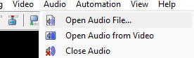

# An episode from preparation to proofwatch

Work on a copy of the ASS and keep the original video and mix available. The separated voice helps reveal speech boundaries; the original mix is the reference for checking them.

## Prepare matching media

Use `01.mkv` and `01.ass` from the same edition. Extract the correct language track and [separate the vocals](vocales.md). Save them as `01.wav`, preserving the full timeline and playback speed. Check a recognizable sound near the beginning, middle, and end against the video.

## Settle the segmentation

Review cues containing several sentences or changes of speaker. Split where the meaning and spoken rhythm support it. After [splitting or joining](division-lineas.md), check ASS formatting and place each cue roughly over its own dialogue.

## Generate the files you need

For Lazy, run **Waveform JSON.bat** on `01.wav`. For Busy, also prepare silence, VAD, flux, and envelope files. Spectral features are optional reference material. **Generate All.bat** produces all nine outputs when the matching video, WAV, and dependencies are present.

The [generators](generadores.md) run outside Aegisub. Check the final status before using their outputs: a failed run can leave older files in place.

## Load the episode in Aegisub {#open-the-project-in-aegisub}

Load the ASS, video, and vocal WAV. If you generated SCXvid cuts, load `01_keyframes.log` as external keyframes. Confirm the frame rate or VFR timecodes and inspect the cuts against the picture.

{ loading=lazy }

## Find the speech boundaries

[Raw timing](../fundamentos/raw-timing.md) covers the speech represented by each cue. Set it by listening and inspecting the waveform, or try **Raw voice** in [Auto Timing](motor.md) on a short selection that already sits near its dialogue. With overlapping voices, check which speaker belongs to the text; the analysis files do not identify characters.

[SubWave](web.md) provides another way to edit against the waveform in a browser. Load the audio as well as the JSON if you want to listen.

## Add reading time and scene adjustments

After reviewing the speech boundaries, choose **Post current**, **Kite Timing**, or Aegisub's Timing Post-Processor for the adjustments needed. They have different settings and do not promise identical output. If you already used **Full + polish**, inspect its padding before running another post-timing pass.

For manual work, start at the end of the scene and work backward: the next cue's start limits the current cue's hold. The individual controls are described in [post-timing tools](postprocesado.md).

## Audit, then watch

Run the [audit](auditoria.md), correct errors, and review the reasons for any warnings you keep. Check formatting after text operations. Finish with a full proofwatch using the original mix, including music, effects, and picture.
