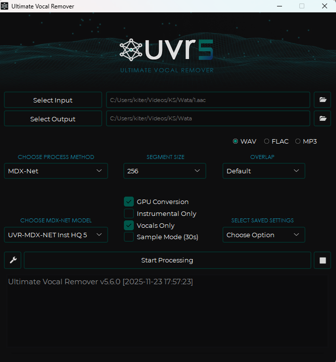

# Generadores de señales

Una señal es un archivo de texto que responde una pregunta sobre el audio o el video:
dónde cambia la escena, dónde hay silencio, dónde habla alguien. Esos archivos se
calculan una vez por episodio, quedan guardados junto al video y los lee después el
motor de timing dentro del editor. Calcularlos por separado permite mirarlos,
compararlos y rehacerlos sin tocar el subtítulo.

La carpeta [Chrono Generators](https://github.com/Kitherow/Chrono-Generators-Scripts)
contiene seis archivos por lotes de producción: `Keyframes
SCXvid.bat`, `Retimes Silencios.bat`, `Features Espectrales.bat`, `Envelope RMS.bat`,
`Waveform JSON.bat` y `Procesar Todo.bat`. Son programas de Windows que se ejecutan
haciendo doble clic o arrastrando los archivos del episodio encima. Incluye además
`Build VADFlux.bat`, que construye `vadflux.exe`, el ejecutable que produce las señales
de voz y flux consumidas por `Retimes Silencios.bat` y `Procesar Todo.bat`. La separación
de la voz se hace aparte, con [UVR](https://github.com/Anjok07/ultimatevocalremovergui),
una aplicación de escritorio con interfaz gráfica. La
generación queda fuera de Chrono Suite; Chrono consume las señales dentro de Aegisub.

`Features Espectrales.bat`, `Waveform JSON.bat`, `Procesar Todo.bat` y `Build VADFlux.bat`
usan `python`. La lógica Python vive embebida dentro del propio `.bat`: el archivo por
lotes se lee a sí mismo, extrae el bloque Python correspondiente y lo ejecuta con el
intérprete instalado. No requieren archivos `.py` junto al generador. `Build VADFlux.bat`
necesita PyInstaller, torch, torchaudio, librosa, soundfile, numpy y numba para compilar
el ejecutable.

## Dos maneras de ejecutar un generador

Cada generador acepta el trabajo de dos formas, y conviene conocer las dos desde el
principio.

La primera es **arrastrar archivos** sobre el icono del generador. Cada archivo soltado
se procesa por su nombre real, sea cual sea. Sirve para un episodio suelto o para una
selección manual.

La segunda es **ejecutarlo sin arrastrar nada**. El generador pregunta un número de
inicio y uno de fin, y recorre la numeración del episodio —`1.mkv`, `02.mkv`,
`03.mp4`— resolviendo sola la extensión y el cero a la izquierda. Sirve para procesar
una serie entera de una vez.

## La preparación del audio

El flujo de timing trabaja con la pista vocal producida por UVR. `Retimes Silencios.bat` y
`Features Espectrales.bat` reducen primero el audio entregado al generador a una forma
estable: una pista mono a 16 kHz, con un filtro que recorta lo que baja de 80 Hz y lo que
sube de 8 kHz, y una normalización dinámica que iguala tramos suaves y fuertes. `Procesar
Todo.bat` reutiliza esa misma preparación para sus silencios, VAD, flux y mapa espectral.
El archivo preparado es temporal y se borra al terminar.

`Waveform JSON.bat` usa otra ruta: decodifica a mono de 48 kHz y escribe picos mínimo y
máximo con resolución base de 1 ms. `Envelope RMS.bat` no usa esa normalización previa:
lee la fuente elegida con FFprobe y escribe la energía RMS cuadro a cuadro. Los BAT aceptan
arrastrar cualquier archivo compatible; para señales de habla, la entrada de trabajo es la
pista vocal. En el modo por rango, `Envelope RMS.bat` y `Procesar Todo.bat` buscan primero
archivos vocales con nombres reconocibles.

## Keyframes SCXvid

Un keyframe, aquí, es un fotograma donde la escena cambia de plano. **Keyframes SCXvid**
recorre el video, lo reduce a una resolución de trabajo y marca esos cambios, dejando un
`_keyframes.log`. Contra esos cortes se alinean después los inicios y los finales.

Se usa cuando el video llega sin keyframes propios o trae unos que no corresponden a
cambios de escena. Procesa solo video; un archivo de audio suelto se omite.

## Retimes Silencios

**Retimes Silencios** produce de una sola pasada tres familias que describen el mismo
audio desde ángulos distintos.

Los **silencios** se miden a tres niveles de exigencia —−30, −40 y −50 dB—, pidiendo al
menos 30 milisegundos de quietud para contar como pausa. El nivel más sensible marca
hasta las micropausas entre palabras; el más estricto solo reconoce el silencio profundo.
Comparar los tres delata la voz baja, la música de fondo y las pausas dudosas. Salen como
`_Retimes_30.txt`, `_Retimes_40.txt` y `_Retimes_50.txt`.

La **detección de voz** marca las regiones con habla probable, con su inicio y su final.
Señala dónde mirar y propone candidatos de borde, sin distinguir quién habla ni qué dice.
Sale como `_Retimes_vad.tsv`.

El **flux** mide cuánto cambia la energía del sonido de un instante al siguiente. Un
cambio brusco delata un ataque: una consonante, una entrada repentina, el comienzo de una
palabra. Afina los inicios que la detección de voz redondea. Sale como `_Retimes_flux.tsv`.

## Features Espectrales

**Features Espectrales** describe la presencia de voz por bandas de frecuencia a lo largo
del tiempo. Donde la detección de voz da un sí o un no, este mapa muestra cuánta energía
hay y en qué región del espectro, lo que separa un susurro real de un resto de música.
Sale como `_Retimes_spectrum.tsv`.

Es una señal de consulta para los tramos ambiguos. El motor de timing trabaja con las
otras familias; este mapa sirve para resolver a ojo las escenas de voz muy baja, mucha
música o capas superpuestas.

## Envelope RMS

**Envelope RMS** resume, cuadro a cuadro, la potencia del audio. Leído sobre una pista
vocal limpia, dibuja la silueta de cada frase: dónde sube el ataque, dónde se sostiene el
cuerpo y dónde decae la cola. Es la señal que mejor separa una respiración final de una
sílaba que todavía pertenece a la palabra, y la que más ayuda a decidir el lead-out.

En modo de rango numérico busca primero una pista vocal junto al material —`01_vocals.wav`,
`01_Vocals.wav`, `vocals_01.wav` y variantes— y también acepta un WAV con el número del
episodio. Al arrastrar un archivo, calcula el envelope de ese archivo. En `Procesar Todo`,
si la entrada es audio se usa la propia entrada; si la entrada es video, se prefiere la
pista vocal cercana. La entrada principal queda como respaldo técnico, fuera del flujo
normal de medición de habla. Sale como `_envelope.tsv`.

## Waveform JSON

**Waveform JSON** convierte el audio en una onda de picos mínimo y máximo, guardada en
varios niveles de resolución para dibujarse rápido tanto alejada como en detalle. Cumple
tres funciones: la lee el método de cronometraje simple para encontrar la voz, se dibuja
para estudiar un caso y la carga el editor web para corregir el pegado en el navegador.
Sale como `.waveform.json`. Su estructura y su editor se describen en
[Onda comprimida](web.md).

## Procesar Todo

**Procesar Todo** integra las mismas operaciones en un solo archivo por lotes. Sobre cada
entrada extrae keyframes si es video, omite keyframes si es audio, mide silencios, VAD,
flux y espectro desde el audio normalizado, escribe la onda comprimida y calcula el
envelope. Los pasos de audio miden la entrada que recibe el BAT; por eso el flujo de
señales de diálogo usa la pista vocal como entrada de trabajo. Cuando se procesa un video,
la búsqueda de una vocal cercana sirve para el envelope y para mantener nombres coherentes,
pero la preparación estricta separa el video para keyframes y la vocal para señales de
audio.

Tras esa pasada sobre `01.mkv` con su `01_vocals.wav`, la carpeta contiene el material más
estas señales:

```text
01_keyframes.log         cambios de escena
01_Retimes_30.txt        silencios a -30 dB
01_Retimes_40.txt        silencios a -40 dB
01_Retimes_50.txt        silencios a -50 dB
01_Retimes_vad.tsv       regiones de voz
01_Retimes_flux.tsv      ataques de flux
01_Retimes_spectrum.tsv  mapa espectral de consulta
01_envelope.tsv          energía RMS de la voz
01.waveform.json         onda comprimida
```

Cada nombre lleva el número del episodio, así que una carpeta con varios episodios
mantiene sus señales separadas. Quién las consume está en [Motor de timing](motor.md); cómo
se leen y se cruzan, en las secciones que siguen.

## Leer las señales

Cada señal aporta una parte del audio y tiene un límite propio; la decisión nace de
cruzarlas. Entender qué aporta cada familia y cuál es su alcance evita confiar en una
pista aislada y colocar un borde donde la evidencia parecía clara.

<div class="tg-signal">
<div class="s">
<p class="name">Silencios <code>_30/40/50.txt</code></p>
<dl>
<dt class="yes">Responde</dt><dd>¿Hay sonido aquí, sí o no?, a tres niveles de exigencia.</dd>
<dt class="no">Límite</dt><dd><i>Qué</i> suena: un golpe de música cuenta igual que una palabra.</dd>
</dl>
</div>
<div class="s">
<p class="name">Detección de voz <code>_vad.tsv</code></p>
<dl>
<dt class="yes">Responde</dt><dd>Dónde habla alguien, con principio y fin de región.</dd>
<dt class="no">Límite</dt><dd>Quién habla; suaviza los extremos y mezcla voces superpuestas.</dd>
</dl>
</div>
<div class="s">
<p class="name">Flux espectral <code>_flux.tsv</code></p>
<dl>
<dt class="yes">Responde</dt><dd>El instante exacto en que el sonido cambia: el filo de una consonante.</dd>
<dt class="no">Límite</dt><dd>Si el cambio es voz; un golpe o una puerta también lo excitan.</dd>
</dl>
</div>
<div class="s">
<p class="name">Mapa espectral <code>_spectrum.tsv</code></p>
<dl>
<dt class="yes">Responde</dt><dd>Cuánta energía hay y en qué bandas: la textura del tramo.</dd>
<dt class="no">Límite</dt><dd>Aporta desempate sobre bordes que otras señales discuten.</dd>
</dl>
</div>
<div class="s">
<p class="name">Envelope <code>_envelope.tsv</code></p>
<dl>
<dt class="yes">Responde</dt><dd>La silueta de energía: ataque, cuerpo y cola de la frase.</dd>
<dt class="no">Límite</dt><dd>Si algo es voz; mide potencia y calla sobre el contenido.</dd>
</dl>
</div>
<div class="s">
<p class="name">Onda comprimida <code>.waveform.json</code></p>
<dl>
<dt class="yes">Responde</dt><dd>La forma cruda del audio, sin interpretación, para ver con los propios ojos.</dd>
<dt class="no">Límite</dt><dd>Funciona como material de consulta junto a otras señales.</dd>
</dl>
</div>
</div>

## Por qué separar la voz

La mezcla final de una obra combina diálogo, música, efectos y masterización en una
sola pista. Para el oído narrativo eso es perfecto; para medir bordes es ruido.
Una pista vocal separada despeja el campo: los silencios dejan de confundir un
acorde sostenido con habla, la detección de voz deja de morder la música con voz
de fondo, los ataques dejan de dispararse con la percusión, y el envelope dibuja la
frase sin la energía ajena que la rodea.

La separación se hace con [UVR](https://github.com/Anjok07/ultimatevocalremovergui),
una aplicación de escritorio, y produce un `WAV` que
conviene nombrar de forma reconocible —`01_vocals.wav` o `vocals_01.wav`— para que los
generadores lo encuentren solos. Sobre esa pista limpia se calculan las señales de audio.
La mezcla completa queda como respaldo técnico fuera del flujo normal, con revisión
posterior más estricta.

{ loading=lazy }

## Leer cruzando

La fuerza de una decisión crece cuando varias familias señalan el mismo punto.
Cuando la detección de voz arranca una región y el flux marca un ataque dentro de
los primeros milisegundos de esa región, el inicio es firme: hay habla y hay un
filo concreto donde empieza. Cuando el envelope conserva energía después de que la
detección de voz haya soltado la región, conviene mirar si esa cola es parte de la
palabra —y va dentro de la línea— o una respiración —y se queda fuera—.

<figure class="tg-fig tg-strip tg-signalmap">
<span class="tg-eyebrow">Cinco señales sobre el mismo eje de tiempo</span>
<div class="lanes">
<div class="lane"><span class="lab">onda</span><span class="seg fade" style="left:20%;width:50%"></span></div>
<div class="lane"><span class="lab">vad</span><span class="seg voz" style="left:20%;width:48%"></span></div>
<div class="lane"><span class="lab">flux</span><i class="pin" style="left:20%"></i><i class="pin" style="left:35%"></i><i class="pin" style="left:52%"></i><i class="pin" style="left:80%"></i></div>
<div class="lane"><span class="lab">envelope</span><span class="seg fade" style="left:20%;width:54%"></span></div>
<div class="lane"><span class="lab">silencios</span><span class="seg aire" style="left:0;width:19%"></span><span class="seg aire" style="left:76%;width:24%"></span></div>
<span class="colmark ok" style="left:20%"></span>
<span class="colmark bad" style="left:80%"></span>
</div>
<div class="scale"><span class="ok" style="left:20%">inicio firme</span><span class="e" style="left:80%">golpe sin voz</span></div>
<span class="cap">Donde las familias coinciden —la región de voz arranca, el flux marca su filo, el silencio termina—, el borde es firme. El pico de flux aislado de la derecha cae sin región de voz alrededor: un golpe o un corte de música, sin borde que proponer.</span>
</figure>

Las contradicciones son igual de informativas. Un pico de flux sin región de voz
alrededor suele delatar un golpe o un corte de música. Un envelope
que sube sin que la detección de voz lo acompañe apunta a música residual o a una
voz que el detector pasó por alto; el mapa espectral suele desempatar. Un tramo que
el oído oye como voz pero que el umbral más estricto marca como silencio avisa de
que ese umbral no sirve para esa escena, y conviene leer los silencios del umbral
sensible.

Cuando la detección de voz empieza claramente antes que el borde de la línea, el
inicio entró tarde y descubre la primera sílaba. Cuando termina después del borde,
el final corta voz. Y cuando un keyframe cae cerca mientras la voz todavía
continúa, la decisión deja de ser de audio y pasa a ser de escena: cubrir la voz o
ceder al corte es ya un juicio de sentido que las señales solo acompañan.

## La prioridad cambia según el borde

El peso de cada evidencia cambia según el borde que se decide. En el **inicio**
manda la voz: el texto debe estar listo cuando la primera sílaba suena, y la
referencia es el ataque vocal, con la escena como matiz cercano. En el **final**
mandan la lectura, la escena y la continuidad: la voz ya cerró, y lo que queda por
resolver es dar tiempo a leer, respetar un corte cercano y no parpadear contra la
línea siguiente.

<div class="tg-cols">
<div class="c inicio">
<h4>En el inicio manda la voz</h4>
<p>El texto debe estar listo cuando la primera sílaba suena. La referencia es el ataque vocal, con la escena como matiz cercano.</p>
</div>
<div class="c final">
<h4>En el final mandan lectura, escena y continuidad</h4>
<p>La voz ya cerró. Queda dar tiempo a leer, respetar un corte cercano y no parpadear contra la línea siguiente.</p>
</div>
</div>

Esta asimetría es la que convierte un montón de señales en un método. El criterio está
en saber, en cada lado de la línea, cuál pregunta manda, y usar las demás señales para
confirmarla o ponerla en duda.
