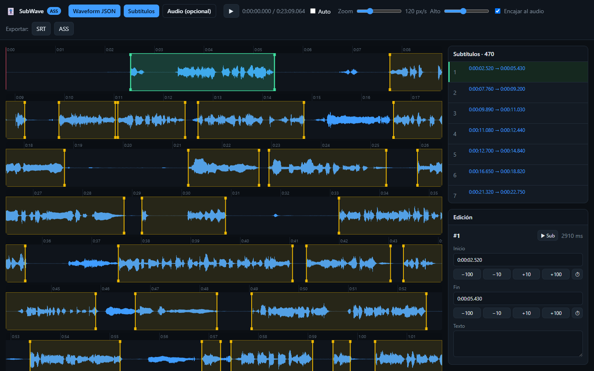
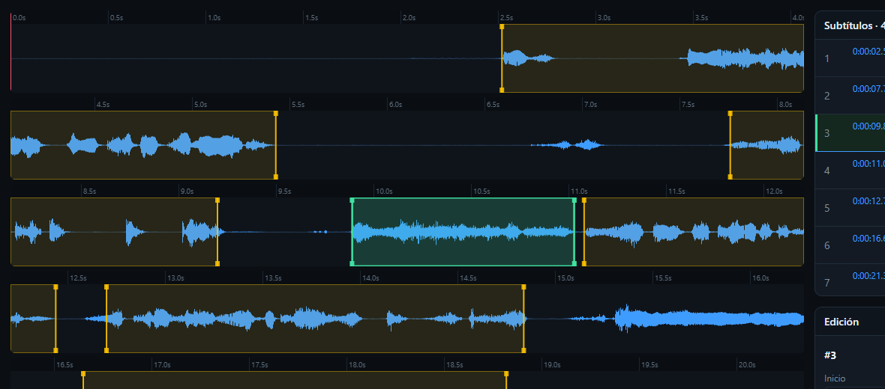

# Onda comprimida

La última capa técnica trabaja sobre la onda comprimida del audio: el cronometraje
automático la lee, la vista de forma de onda la dibuja y un editor web corrige el
pegado sobre ella. Es el material con el que se estudia un caso difícil, se documenta
una decisión, se enseña el criterio a otra persona o se repara un timing bruto lejos
del entorno de producción.

## La onda comprimida

Una pista de audio tiene decenas de miles de muestras por segundo; dibujarlas todas
para ver una frase es derrochador. La onda comprimida resuelve esto guardando, en
lugar de cada muestra, el valor mínimo y máximo de pequeños bloques de tiempo, y lo
hace a varios niveles de resolución a la vez: un nivel grueso para ver un minuto de
audio de un vistazo, uno fino para distinguir el ataque de una consonante. Quien
dibuja la onda elige el nivel según cuánto haya ampliado.

El archivo declara primero las propiedades globales del audio y después la lista de
niveles. Cada nivel guarda sus picos como pares de mínimo y máximo intercalados:

```json
{
  "type": "waveform",
  "version": 1,
  "sampleRate": 48000,
  "channels": 1,
  "bits": 16,
  "amplitudeFormat": "s16",
  "amplitudeMin": -32768,
  "amplitudeMax": 32767,
  "pointLayout": "interleavedMinMax",
  "durationMs": 4,
  "totalSamples": 192,
  "levels": [
    {
      "scale": 1,
      "pointMs": 1,
      "samplesPerPoint": 48,
      "points": 4,
      "peaks": [-1200, 1400, -800, 900, -600, 760, -300, 420]
    },
    {
      "scale": 2,
      "pointMs": 2,
      "samplesPerPoint": 96,
      "points": 2,
      "peaks": [-1200, 1400, -600, 760]
    }
  ]
}
```

Dentro de cada nivel, `pointMs` dice cuánto tiempo cubre cada punto, `samplesPerPoint`
cuántas muestras se resumieron en él y `points` cuántos puntos tiene el nivel; `peaks`
es la secuencia de pares mínimo/máximo. Para timing, el campo que más importa es
`pointMs`: cuanto más pequeño, más fino el dibujo y mejor se distinguen los ataques
reales. El nivel base del generador oficial es de 1 ms; los niveles siguientes duplican
la escala para dibujar tramos largos con menos puntos. `amplitudeMin` y `amplitudeMax`
permiten normalizar la altura del trazo para que la onda use todo el alto disponible.

Este es el archivo que produce el generador de onda y que el método de cronometraje
simple recorre para encontrar la voz. La misma estructura sirve a una representación
gráfica y a la detección automática, lo que mantiene una sola fuente para mirar y para
medir.

## Mirar la onda

Leer la onda es leer la silueta de la frase. El trazo sube en el ataque de cada
palabra, se sostiene en el cuerpo y baja en la cola; entre intervenciones cae a la
línea de base. Esa forma es la que guía los dos bordes.

<figure class="tg-fig tg-strip">
<span class="tg-eyebrow">Una frase en la onda</span>
<div class="lane">
<span class="seg aire" style="left:6%;width:7%"><i>base</i></span>
<span class="seg voz" style="left:13%;width:50%">cuerpo de la voz · «espera, escúchame»</span>
<span class="seg aire" style="left:63%;width:11%"><i>cola</i></span>
<i class="pin" style="left:13%"></i>
<i class="kf" style="left:82%"></i>
</div>
<div class="scale"><span class="v" style="left:13%">ataque</span><span class="e" style="left:82%">keyframe</span></div>
<div class="tg-keys">
<b class="k-voz">el ataque marca el inicio</b>
<b class="k-aire">la cola decide hasta dónde llega el final</b>
<b class="k-escena">un keyframe cercano puede cerrar la línea</b>
</div>
<span class="cap">El <b>ataque</b> fija el inicio; la <b>cola</b> de energía dice cuánto aire de lectura cabe antes de que la frase muera. Donde la onda no basta para decidir, se cruza con las demás señales.</span>
</figure>

La altura del trazo, normalizada con `amplitudeMin` y `amplitudeMax`, distingue una
voz franca de un resto tenue; la resolución, fijada por `pointMs`, decide si se ve el
filo de una consonante o solo el bulto de la frase. La misma estructura sirve a la
vista gráfica y a la detección automática, lo que mantiene una sola fuente para mirar
y para medir.

## El editor sobre la onda

[SubWave](https://kiterowx.github.io/SubWave-Editor/) es la
vista de forma de onda convertida en editor,
que carga la onda comprimida del episodio, dibuja encima las líneas del subtítulo y
permite corregir cada borde arrastrándolo sobre la evidencia. Funciona en cualquier
navegador, sin instalación, así que el pegado se repara también en una máquina donde
Aegisub queda lejos.

El trabajo dentro de la página sigue el orden de carga. Primero entra el
`.waveform.json` del episodio, el mismo archivo que produce **Waveform JSON**; después
el subtítulo, en `.ass`, `.ssa` o `.srt`; y de forma opcional el audio, que habilita
escuchar el tramo de cada línea antes de dar un borde por bueno. Cada línea se elige
desde la línea de tiempo o desde la lista, y sus dos límites se mueven arrastrándolos
sobre la onda o escribiendo el valor en el panel de edición. Al exportar, el `.ass`
conserva la cabecera, los estilos y todos los campos que quedaron sin tocar: del
archivo cambian solo los tiempos corregidos, y el guion vuelve a producción intacto en
todo lo demás. La exportación a `.srt` cubre los formatos de texto plano.

<figure class="tg-fig">
<span class="tg-eyebrow">Carga completa del episodio</span>

<span class="cap">Con la onda, los subtítulos y el audio cargados, la línea seleccionada queda visible en la línea de tiempo y en el panel de edición. El conteo confirma que el subtítulo entró completo y los botones de exportación quedan activos.</span>
</figure>

Su terreno es el timing bruto. La onda enseña el ataque y la cola de cada frase, y el
arrastre fino deja el intervalo desnudo de voz donde el criterio de
[Raw timing](../fundamentos/raw-timing.md) lo pide: es la herramienta para reparar un
pegado que entró tarde, cortó una sílaba o arrastró ruido, línea por línea y con la
evidencia delante. Los márgenes, el snap y la cadena se aplican después, en Aegisub,
donde viven los keyframes y el post-timing de
[Chrono Suite](https://github.com/Kiterowx/Kite-Aegisub-Scripts/blob/main/docs/ChronoSuite.md).

<figure class="tg-fig">
<span class="tg-eyebrow">Borde elegido sobre la onda</span>

<span class="cap">El rectángulo seleccionado deja ver el inicio, el final y la energía de voz. El ajuste se decide mirando el ataque y la cola antes de exportar el subtítulo corregido.</span>
</figure>

En la jerarquía de la fase técnica ocupa el mismo escalón que el pegado manual dentro
del editor de escritorio: decide sobre el plano de la voz y deja la lectura, la escena
y la continuidad para las pasadas siguientes. Con el método Lazy forma un espejo
deliberado: ambos leen el mismo `.waveform.json`, Lazy lo recorre por su cuenta y el
editor lo pone delante de los ojos, de modo que un borde que la automatización propuso
se puede revisar a mano sobre la misma señal que lo originó. Y la jerarquía de
Fundamentos sigue siendo el techo: la onda muestra dónde está la voz, y la razón de
cada ajuste se nombra igual que en cualquier otro borde.
